# 线程基础

## 说明

本部分笔记及源码出自`slide/03Linux多线程开发/01 线程基础`

## 线程概述

### 基本概念

- 与`进程（process）`类似，`线程（thread）`是允许应用程序**并发执行多个任务**的一种机制
- 一个进程可以包含多个线程
- 同一个程序中的所有线程均会独立执行`相同程序`，且共享同一份`全局内存`区域，其中包括初始化数据段、未初始化数据段，以及堆内存段。（传统意义上的 UNIX 进程只是多线程程序的一个特例，该进程只包含一个线程）
- **进程是 CPU 分配资源的最小单位，线程是操作系统调度执行的最小单位**
- 线程是轻量级的进程（`LWP：Light Weight Process`），`在 Linux 环境下线程的本质仍是进程`
- 查看指定进程的 `LWP` 号：`ps –Lf pid`，其中`pid`可以由`ps aux`得到
- 一般情况下，`main函数`所在的线程我们称之为`主线程（main线程）`，其余创建的线程称为`子线程`
  - 程序中默认只有一个进程，`fork()`函数调用，2进程（父子进程）
  - 程序中默认只有一个线程，`pthread_create()`函数调用，2个线程（主线程和子线程）

### 线程和进程区别

- **进程间的信息难以共享**。由于除去只读代码段外（因为读时共享），父子进程并未共享内存，因此必须采用一些`进程间通信方式`，在进程间进行信息交换
- 调用 `fork()` 来创建进程的代价相对较高，即便利用写时复制技术，仍然需要复制诸如内存页表和文件描述符表之类的多种进程属性，这意味着 `fork()` 调用在时间上的开销依然不菲
- 线程之间能够方便、快速地共享信息。只需**将数据复制到共享（全局或堆）变量**中即可
- 创建线程比创建进程通常要快 10 倍甚至更多。线程间是`共享虚拟地址空间`的，无需采用写时复制来复制内存，也无需复制页表

### 线程之间共享和非共享资源

#### 共享资源

- 进程 ID 和父进程 ID
- 进程组 ID 和会话 ID
- 用户 ID 和 用户组 ID
- 文件描述符表
- 信号处置
- 文件系统的相关信息：文件权限掩码（umask）、当前工作目录
- 虚拟地址空间（**除栈、.text(代码段)**）

#### 非共享资源

- 线程 ID
- 信号掩码
- 线程特有数据
- error 变量
- 实时调度策略和优先级
- 栈，本地变量和函数的调用链接信息

### NPTL

- 当 Linux 最初开发时，在内核中并不能真正支持线程。但是它的确可以通过 `clone()` 系统调用将进程作为可调度的实体。这个调用创建了调用进程（calling process）的一个拷贝，这个拷贝与调用进程共享相同的地址空间。`LinuxThreads` 项目使用这个调用来完成在用户空间模拟对线程的支持。不幸的是，这种方法有一些缺点，尤其是在信号处理、调度和进程间同步等方面都存在问题。另外，这个线程模型也不符合 `POSIX` 的要求
- 要改进 `LinuxThreads`，需要内核的支持，并且重写线程库。有两个相互竞争的项目开始来满足这些要求
  - 一个包括 IBM 的开发人员的团队开展了 `NGPT（Next-Generation POSIX Threads）`项目
  - 同时，Red Hat 的一些开发人员开展了 `NPTL` 项目
  - `NGPT` 在 2003 年中期被放弃了，把这个领域完全留给了 `NPTL`

- `NPTL`，或称为 `Native POSIX Thread Library`，是 Linux 线程的一个新实现，它克服了 `LinuxThreads `的缺点，同时也符合 `POSIX` 的需求。与 `LinuxThreads` 相比，它在性能和稳定性方面都提供了重大的改进

- 查看当前 `pthread` 库版本：`getconf GNU_LIBPTHREAD_VERSION`

  

### 注意

- 由于`pthread`属于第三方库，所以在编译时需要加上参数`-pthread`或`-lpthread`即指定包路径，如果不加报以下错误（执行程序为线程创建）

  

## 线程操作函数

- 获取当前的线程的线程ID：`pthread_t pthread_self(void);`

- 比较两个线程ID是否相等：`int pthread_equal(pthread_t t1, pthread_t t2);`

  > 不同的操作系统，`pthread_t`类型的实现不一样，有的是无符号的长整型，有的是使用结构体去实现的

- 线程创建：``int pthread_create(pthread_t *thread, const pthread_attr_t *attr, void *(*start_routine) (void *), void *arg);``

- 线程终止：`void pthread_exit(void *retval);`

## 线程创建

- `int pthread_create(pthread_t *thread, const pthread_attr_t *attr, void *(*start_routine) (void *), void *arg);`
  - 通过`man 3 pthread_create`查看帮助
  - 功能：创建一个子线程
  - 参数
    - `thread`：传出参数，线程创建成功后，子线程的线程ID被写到该变量中
    - `attr` : 设置线程的属性，一般使用默认值，NULL
    - `start_routine` : 函数指针，这个函数是子线程需要处理的逻辑代码
    - `arg` : 给第三个参数(`start_routine`)使用，传参
  - 返回值
    - 成功：0
    - 失败：返回错误号。这个错误号和之前`errno`不太一样。获取错误号的信息：  `char * strerror(int errnum);`

```c
#include <stdio.h>
#include <pthread.h>
#include <string.h>
#include <unistd.h>

void* myWork(void* arg) {
    printf("child thread...\n");
    printf("num = %d\n", *(int*)arg);
    
    return NULL;
}

int main()
{
    // 创建子线程
    pthread_t tid;
    int num = 10;
    int ret = pthread_create(&tid, NULL, myWork, (void*)&num);
    if (ret != 0) {
        char * errstr = strerror(ret);
        printf("error : %s\n", errstr);
    }

    for (int i = 0; i < 5; i++) {
        printf("%d\n", i);
    }

    // 防止子线程没有抢占到CPU且此时主线程已经执行完并退出
    sleep(1);
    return 0;
}
```

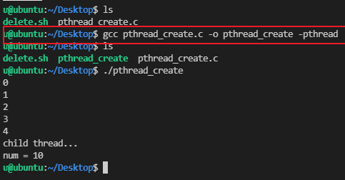

## 线程终止

- `void pthread_exit(void *retval);`
  - 通过`man 3 pthread_exit`查看帮助
  - 功能：终止一个线程，在哪个线程中调用，就表示终止哪个线程
  - 参数：`retval`，需要传递一个指针，作为一个返回值，可以在`pthread_join()`中获取到

```c
#include <stdio.h>
#include <pthread.h>
#include <string.h>
#include <unistd.h>

void* myWork(void* arg) {
    printf("child thread...\n");
    printf("num = %d\n", *(int*)arg);
    printf("child thread id : %ld\n", pthread_self());

    return NULL;
}

int main()
{
    // 创建子线程
    pthread_t tid;
    int num = 10;
    int ret = pthread_create(&tid, NULL, myWork, (void*)&num);
    if (ret != 0) {
        char * errstr = strerror(ret);
        printf("error : %s\n", errstr);
    }
    printf("tid : %ld, main thread id : %ld\n", tid ,pthread_self());

    for (int i = 0; i < 5; i++) {
        printf("%d\n", i);
    }

    // 让主线程退出，当主线程退出时，不会影响其他正常运行的线程
    pthread_exit(NULL);
    // 下面程序已经不能被执行
    printf("test message\n");

    return 0;
}
```

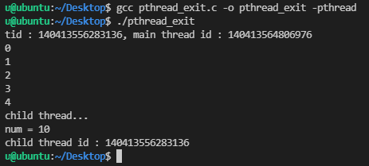

## 线程连接

- `int pthread_join(pthread_t thread, void **retval);`
  - 通过`man 3 pthread_join`查看帮助
  - 功能：和一个已经终止的线程进行连接。`回收子线程的资源`，这个函数是阻塞函数，调用一次只能回收一个子线程，一般在主线程中使用
  - 参数
    - `thread`：需要回收的子线程的ID
    - `retval`：接收子线程退出时的返回值
  - 返回值
    - 成功：0
    - 失败：返回错误号。这个错误号和之前`errno`不太一样。获取错误号的信息：  `char * strerror(int errnum);`

```c
#include <stdio.h>
#include <pthread.h>
#include <string.h>
#include <unistd.h>

int val = 10;

void* myWork(void* arg) {
    printf("child thread...\n");
    printf("num = %d\n", *(int*)arg);
    printf("child thread id : %ld\n", pthread_self());
    val++;
    
    pthread_exit((void*)&val);     // 等价于return (void*)&val;
}

int main()
{
    printf("init val : %d\n", val);
    // 创建子线程
    pthread_t tid;
    int num = 10;
    int ret = pthread_create(&tid, NULL, myWork, (void*)&num);
    if (ret != 0) {
        char * errstr = strerror(ret);
        printf("error : %s\n", errstr);
    }
    printf("tid : %ld, main thread id : %ld\n", tid ,pthread_self());

    for (int i = 0; i < 5; i++) {
        printf("%d\n", i);
    }

    // 主线程调用pthread_join()回收子线程的资源
    int * thread_retval;
    ret = pthread_join(tid, (void **)&thread_retval);

    if(ret != 0) {
        char * errstr = strerror(ret);
        printf("error : %s\n", errstr);
    }
    printf("exit data : %d\n", *thread_retval);
    printf("回收子线程资源成功！\n");
    
    // 让主线程退出，当主线程退出时，不会影响其他正常运行的线程
    pthread_exit(NULL);
    // 下面程序已经不能被执行
    printf("test message\n");

    return 0;
}
```


## 线程分离

- `int pthread_detach(pthread_t thread);`
  - 通过`man 3 pthread_detach`查看帮助
  - 功能：分离一个线程。被分离的线程在终止的时候，会自动释放资源返回给系统
    - 不能多次分离，会产生不可预料的行为
    - 不能去连接一个已经分离的线程，会报错
  - 参数：需要分离的线程的ID
  - 返回值
    - 成功：0
    - 失败：返回错误号。这个错误号和之前`errno`不太一样。获取错误号的信息：  `char * strerror(int errnum);`

```c
#include <stdio.h>
#include <pthread.h>
#include <string.h>
#include <unistd.h>

void* myWork(void * arg) {
    printf("chid thread id : %ld\n", pthread_self());
    return NULL;
}

int main() 
{
    // 创建一个子线程
    pthread_t tid;
    int ret = pthread_create(&tid, NULL, myWork, NULL);
    if(ret != 0) {
        char * errstr = strerror(ret);
        printf("error1 : %s\n", errstr);
    }

    // 输出主线程和子线程的id
    printf("tid : %ld, main thread id : %ld\n", tid, pthread_self());

    // 设置子线程分离,子线程分离后，子线程结束时对应的资源就不需要主线程释放
    ret = pthread_detach(tid);
    if(ret != 0) {
        char * errstr = strerror(ret);
        printf("error2 : %s\n", errstr);
    }

    // 设置分离后，对分离的子线程进行连接 pthread_join()
    // ret = pthread_join(tid, NULL);
    // if(ret != 0) {
    //     char * errstr = strerror(ret);
    //     printf("error3 : %s\n", errstr);
    // }

    pthread_exit(NULL);

    return 0;
}
```


## 线程取消

- `int pthread_cancel(pthread_t thread);`
  - 通过`man 3 pthread_cancel`查看帮助
  - 功能：取消线程（让线程终止）。取消某个线程，可以终止某个线程的运行， 但是并不是立马终止，而是当子线程执行到一个**取消点**，线程才会终止
  - **取消点**：系统规定好的一些系统调用，我们可以粗略的理解为从用户区到内核区切换的位置，可以通过`man pthreads`查看取消点

```c
#include <stdio.h>
#include <pthread.h>
#include <string.h>
#include <unistd.h>

void* myWork(void * arg) {
    printf("chid thread id : %ld\n", pthread_self());
    for (int i = 0; i < 20; i++) {
        printf("child: %d\n", i);
    }
    return NULL;
}

int main() 
{
    // 创建一个子线程
    pthread_t tid;
    int ret = pthread_create(&tid, NULL, myWork, NULL);
    if(ret != 0) {
        char * errstr = strerror(ret);
        printf("error1 : %s\n", errstr);
    }
    
    // 线程取消
    pthread_cancel(tid);
    for (int i = 0; i < 20; i++) {
        printf("main: %d\n", i);
    }

    // 输出主线程和子线程的id
    printf("tid : %ld, main thread id : %ld\n", tid, pthread_self());

    pthread_exit(NULL);

    return 0;
}
```

- 以上代码在不同机器可能无法触发线程取消，每次执行结果也不一定相同=>==猜测由于速度过快==

  - 虚拟机

    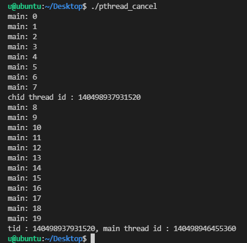

  - 实体机

    

## 线程属性

### 常用API

- 线程属性类型：`pthread_attr_t`
- 初始化线程属性变量：`int pthread_attr_init(pthread_attr_t *attr);`
- 释放线程属性的资源：`int pthread_attr_destroy(pthread_attr_t *attr);`
- 获取线程分离的状态属性：`int pthread_attr_getdetachstate(const pthread_attr_t *attr, int *detachstate);`
- 设置线程分离的状态属性：`int pthread_attr_setdetachstate(pthread_attr_t *attr, int detachstate);`

### 设置步骤

1. 创建一个线程属性变量
2. 初始化属性变量
3. 设置属性
4.  释放线程属性资源

### 实例：通过设置线程属性实现线程分离

```c
#include <stdio.h>
#include <pthread.h>
#include <string.h>
#include <unistd.h>

void* myWork(void * arg) {
    printf("chid thread id : %ld\n", pthread_self());
    for (int i = 0; i < 5; i++) {
        printf("child: %d\n", i);
    }
    return NULL;
}

int main() 
{
    // 1. 创建一个线程属性变量
    pthread_attr_t attr;
    // 2. 初始化属性变量
    pthread_attr_init(&attr);
    // 3. 设置属性-线程分离
    pthread_attr_setdetachstate(&attr, PTHREAD_CREATE_DETACHED);

    // 创建一个子线程
    pthread_t tid;
    int ret = pthread_create(&tid, NULL, myWork, NULL);
    if(ret != 0) {
        char * errstr = strerror(ret);
        printf("error1 : %s\n", errstr);
    }
    
    // 获取线程的栈的大小
    size_t size;
    pthread_attr_getstacksize(&attr, &size);
    printf("thread stack size : %ld\n", size);

    // 输出主线程和子线程的id
    printf("tid : %ld, main thread id : %ld\n", tid, pthread_self());
    // 4. 释放线程属性资源
    pthread_attr_destroy(&attr);

    pthread_exit(NULL);

    return 0;
}
```


# 线程同步

## 说明

本部分笔记及源码出自`slide/03Linux多线程开发/02 线程同步`

## ==疑问==

什么时候加锁合适？不同时机加锁可能会导致不一样的结果

## 出现的原因

- 假设我有100张票，有三个窗口同时在售卖，那么
- 如果`ticket`为局部变量，那么每个窗口都是从100开始售卖=>执行`test1()`
- 如果`ticket`为全局变量，那么不同窗口可能因为抢占资源而同时开始售卖，导致出现同时在卖同一张票（可能出现负数票）=>执行`test2()`

```c
#include <stdio.h>
#include <pthread.h>

void* selltickets1(void* arg) {
    int tickets = 10;
    while (tickets > 0) {
        printf("线程%ld 正在售卖第%d张票\n", pthread_self(), tickets);
        tickets--;
    }

    return NULL;
}

void test1() {
    // 创建三个线程
    pthread_t tid1;
    pthread_t tid2;
    pthread_t tid3;
    pthread_create(&tid1, NULL, selltickets1, NULL);
    pthread_create(&tid2, NULL, selltickets1, NULL);
    pthread_create(&tid3, NULL, selltickets1, NULL);
    // 线程连接，回收子线程的资源，阻塞
    pthread_join(tid1, NULL);
    pthread_join(tid2, NULL);
    pthread_join(tid3, NULL);
}

int total_tickets = 10;

void* selltickets2(void* arg) {
    while (total_tickets > 0) {
        printf("线程%ld 正在售卖第%d张票\n", pthread_self(), total_tickets);
        total_tickets--;
    }

    return NULL;
}

void test2() {
    // 创建三个线程
    pthread_t tid1;
    pthread_t tid2;
    pthread_t tid3;
    pthread_create(&tid1, NULL, selltickets2, NULL);
    pthread_create(&tid2, NULL, selltickets2, NULL);
    pthread_create(&tid3, NULL, selltickets2, NULL);
    // 线程连接，回收子线程的资源，阻塞
    pthread_join(tid1, NULL);
    pthread_join(tid2, NULL);
    pthread_join(tid3, NULL);
}


int main()
{
    test2();
    pthread_exit(NULL);     // 退出main进程
    return 0;
}
```

- 执行`test1`

  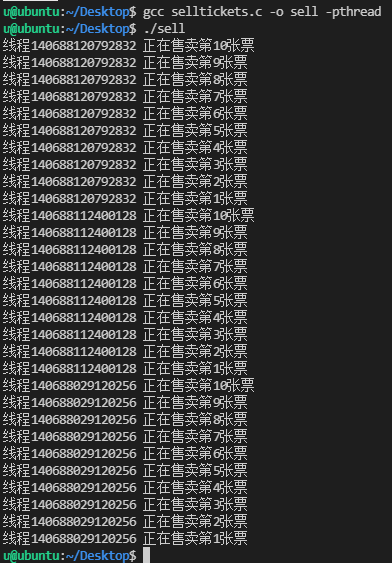

- 执行`test2`

  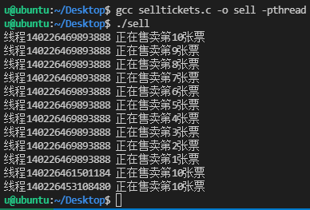

## 线程同步概念

- 线程的主要优势在于，**能够通过全局变量来共享信息**。不过，这种便捷的共享是有代价的：必须确保多个线程不会同时修改同一变量，或者某一线程不会读取正在由其他线程修改的变量
- `临界区`是指访问某一共享资源的代码片段，并且这段代码的执行应为`原子操作`，也就是同时访问同一共享资源的其他线程不应终端该片段的执行
- `线程同步`：即**当有一个线程在对内存进行操作时，其他线程都不可以对这个内存地址进行操作，直到该线程完成操作，其他线程才能对该内存地址进行操作，而其他线程则处于等待状态**

## 互斥量/互斥锁

### 基本概念

- 为避免线程更新共享变量时出现问题，可以使用`互斥量（mutex 是 mutual exclusion的缩写）`来确保同时仅有一个线程可以访问某项共享资源。使用**互斥量能保证对任意共享资源的原子访问**

- 互斥量有两种状态：`已锁定（locked）`和`未锁定（unlocked）`。任何时候，**至多只有一个线程可以锁定该互斥量**。试图对已经锁定的某一互斥量再次加锁，将可能阻塞线程或者报错失败，具体取决于加锁时使用的方法

- 一旦线程锁定互斥量，随即成为该互斥量的所有者，**只有所有者才能给互斥量解锁**。一般情况下，对每一共享资源（可能由多个相关变量组成）会使用不同的互斥量，每一线程在访问同一资源时将采用如下协议

  - 针对共享资源锁定互斥量
  - 访问共享资源
  - 对互斥量解锁

- 如果多个线程试图执行这一块代码（一个临界区），事实上只有一个线程能够持有该互斥量（其他线程将遭到阻塞），即同时只有一个线程能够进入这段代码区域，如下

  

### 互斥量相关操作函数

- 互斥量的类型：`pthread_mutex_t`
- 初始化互斥量：`int pthread_mutex_init(pthread_mutex_t *restrict mutex, const pthread_mutexattr_t *restrict attr);`
  - 参数
    - `mutex` ： 需要初始化的互斥量变量
    - `attr` ： 互斥量相关的属性，设置为NULL，由内核指定
  - `restrict` : C语言的修饰符，被修饰的指针，不能由另外的一个指针进行操作

- 释放互斥量的资源：`int pthread_mutex_destroy(pthread_mutex_t *mutex);`
- 加锁：`int pthread_mutex_lock(pthread_mutex_t *mutex);`
- 尝试加锁：`int pthread_mutex_trylock(pthread_mutex_t *mutex);`
- 解锁：`int pthread_mutex_unlock(pthread_mutex_t *mutex);`

### 实例：互斥锁实现进程同步售票

```c
#include <stdio.h>
#include <pthread.h>

// 全局变量创建互斥量，保证所有线程都能访问
pthread_mutex_t mutex;

int total_tickets = 100;

void* selltickets(void* arg) {
    while (1) {
        // 加锁
        pthread_mutex_lock(&mutex);
        if (total_tickets > 0) {
            // 访问共享变量
            printf("线程%ld 正在售卖第%d张票\n", pthread_self(), total_tickets);
            total_tickets--;
        } else {
            // 解锁
            pthread_mutex_unlock(&mutex);
            break;
        }
        // 解锁
        pthread_mutex_unlock(&mutex);
    }

    return NULL;
}

int main()
{
    // 初始化互斥量
    pthread_mutex_init(&mutex, NULL);

    // 创建三个线程
    pthread_t tid1;
    pthread_t tid2;
    pthread_t tid3;
    pthread_create(&tid1, NULL, selltickets, NULL);
    pthread_create(&tid2, NULL, selltickets, NULL);
    pthread_create(&tid3, NULL, selltickets, NULL);
    // 线程连接，回收子线程的资源，阻塞
    pthread_join(tid1, NULL);
    pthread_join(tid2, NULL);
    pthread_join(tid3, NULL);
    pthread_exit(NULL);     // 退出main进程

    // 释放互斥量资源
    pthread_mutex_destroy(&mutex);
    return 0;
}
```

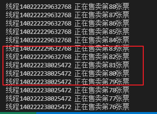

## 死锁

### 基本概念

- 一个线程需要同时访问两个或更多不同的共享资源，而每个资源又都由不同的互斥量管理。当超过一个线程加锁同一组互斥量时，就有可能发生`死锁`
- 两个或两个以上的进程在执行过程中，因争夺共享资源而造成的一种互相等待的现象，若无外力作用，它们都将无法推进下去。此时称系统处于死锁状态或系统产生了死锁

### 死锁的几种场景

#### 忘记释放锁

```c
#include <stdio.h>
#include <pthread.h>
#include <unistd.h>

// 全局变量，所有的线程都共享这一份资源。
int tickets = 1000;

// 创建一个互斥量
pthread_mutex_t mutex;

void * sellticket(void * arg) {

    // 卖票
    while(1) {
        // 加锁
        pthread_mutex_lock(&mutex);

        if(tickets > 0) {
            usleep(6000);
            printf("%ld 正在卖第 %d 张门票\n", pthread_self(), tickets);
            tickets--;
        }else {
            // 解锁
            pthread_mutex_unlock(&mutex);
            break;
        }
        
    }

    return NULL;
}

int main() 
{
    // 初始化互斥量
    pthread_mutex_init(&mutex, NULL);

    // 创建3个子线程
    pthread_t tid1, tid2, tid3;
    pthread_create(&tid1, NULL, sellticket, NULL);
    pthread_create(&tid2, NULL, sellticket, NULL);
    pthread_create(&tid3, NULL, sellticket, NULL);

    // 回收子线程的资源,阻塞
    pthread_join(tid1, NULL);
    pthread_join(tid2, NULL);
    pthread_join(tid3, NULL);

    pthread_exit(NULL); // 退出主线程

    // 释放互斥量资源
    pthread_mutex_destroy(&mutex);

    return 0;
}
```

#### 重复加锁

```c
#include <stdio.h>
#include <pthread.h>
#include <unistd.h>

// 全局变量，所有的线程都共享这一份资源。
int tickets = 1000;

// 创建一个互斥量
pthread_mutex_t mutex;

void * sellticket(void * arg) {

    // 卖票
    while(1) {

        // 加锁
        pthread_mutex_lock(&mutex);
        pthread_mutex_lock(&mutex);

        if(tickets > 0) {
            usleep(6000);
            printf("%ld 正在卖第 %d 张门票\n", pthread_self(), tickets);
            tickets--;
        }else {
            // 解锁
            pthread_mutex_unlock(&mutex);
            break;
        }

        // 解锁
        pthread_mutex_unlock(&mutex);
        pthread_mutex_unlock(&mutex);
    }

    return NULL;
}

int main() {

    // 初始化互斥量
    pthread_mutex_init(&mutex, NULL);

    // 创建3个子线程
    pthread_t tid1, tid2, tid3;
    pthread_create(&tid1, NULL, sellticket, NULL);
    pthread_create(&tid2, NULL, sellticket, NULL);
    pthread_create(&tid3, NULL, sellticket, NULL);

    // 回收子线程的资源,阻塞
    pthread_join(tid1, NULL);
    pthread_join(tid2, NULL);
    pthread_join(tid3, NULL);

    pthread_exit(NULL); // 退出主线程

    // 释放互斥量资源
    pthread_mutex_destroy(&mutex);

    return 0;
}
```

#### 多线程多锁，抢占锁资源

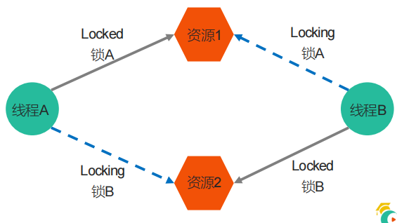

```c
#include <stdio.h>
#include <pthread.h>
#include <unistd.h>

// 创建2个互斥量
pthread_mutex_t mutex1, mutex2;

void * workA(void * arg) {

    pthread_mutex_lock(&mutex1);
    sleep(1);
    pthread_mutex_lock(&mutex2);

    printf("workA....\n");

    pthread_mutex_unlock(&mutex2);
    pthread_mutex_unlock(&mutex1);
    return NULL;
}


void * workB(void * arg) {
    pthread_mutex_lock(&mutex2);
    sleep(1);
    pthread_mutex_lock(&mutex1);

    printf("workB....\n");

    pthread_mutex_unlock(&mutex1);
    pthread_mutex_unlock(&mutex2);

    return NULL;
}

int main() {

    // 初始化互斥量
    pthread_mutex_init(&mutex1, NULL);
    pthread_mutex_init(&mutex2, NULL);

    // 创建2个子线程
    pthread_t tid1, tid2;
    pthread_create(&tid1, NULL, workA, NULL);
    pthread_create(&tid2, NULL, workB, NULL);

    // 回收子线程资源
    pthread_join(tid1, NULL);
    pthread_join(tid2, NULL);

    // 释放互斥量资源
    pthread_mutex_destroy(&mutex1);
    pthread_mutex_destroy(&mutex2);

    return 0;
}
```

## 读写锁

### 基本概念

- 当有一个线程已经持有互斥锁时，互斥锁将所有试图进入临界区的线程都阻塞住。但是考虑一种情形，当前持有互斥锁的线程只是要读访问共享资源，而同时有其它几个线程也想读取这个共享资源，但是由于互斥锁的排它性，所有其它线程都无法获取锁，也就无法读访问共享资源了，但是实际上多个线程同时读访问共享资源并不会导致问题
- 在对数据的读写操作中，**更多的是读操作，写操作较少**，例如对数据库数据的读写应用。为了满足当前能够允许多个读出，但只允许一个写入的需求，线程提供了读写锁来实现
- 读写锁的特点
  - 如果有其它线程读数据，则允许其它线程执行读操作，但不允许写操作
  - 如果有其它线程写数据，则其它线程都不允许读、写操作
  - 写是独占的，写的优先级高

### 读写锁相关操作函数

- 读写锁的类型：`pthread_rwlock_t`
- 初始化读写锁：`int pthread_rwlock_init(pthread_rwlock_t *restrict rwlock, const pthread_rwlockattr_t *restrict attr);`

- 释放互斥量的资源：`int pthread_rwlock_destroy(pthread_rwlock_t *rwlock);`
- 读操作加锁：`int pthread_rwlock_rdlock(pthread_rwlock_t *rwlock);`
- 读操作尝试加锁：`int pthread_rwlock_tryrdlock(pthread_rwlock_t *rwlock);`
- 写操作加锁：`int pthread_rwlock_wrlock(pthread_rwlock_t *rwlock);`
- 写操作尝试加锁：`int pthread_rwlock_trywrlock(pthread_rwlock_t *rwlock);`
- 解锁：`int pthread_rwlock_unlock(pthread_rwlock_t *rwlock);`

### 实例：读写锁实现读线程数量大于写线程数量

- 8个线程操作同一个全局变量。3个线程不定时写这个全局变量，5个线程不定时的读这个全局变量

```c
#include <stdio.h>
#include <pthread.h>
#include <unistd.h>

int num = 0;
// 创建读写锁
pthread_rwlock_t rwlock;

void* workA(void* arg) {
    while (1) {
        // 加写锁
        pthread_rwlock_wrlock(&rwlock);
        num++;
        printf("++write, tid : %ld, num : %d\n", pthread_self(), num);
        // 解锁
        pthread_rwlock_unlock(&rwlock);
        usleep(100);
    }
    
    return NULL;
}

void* workB(void* arg) {
    while (1) {
        // 加读锁
        pthread_rwlock_rdlock(&rwlock);
        printf("===read, tid : %ld, num : %d\n", pthread_self(), num);
        // 解锁
        pthread_rwlock_unlock(&rwlock);
        usleep(100);
    }

    return NULL;
}

int main()
{
    // 初始化读写锁
    pthread_rwlock_init(&rwlock, NULL);
    // 创建8个线程，3个写线程，5个读线程
    pthread_t wtids[3], rtids[5];
    for (int i = 0; i < 3; i++) {
        pthread_create(&wtids[i], NULL, workA, NULL);
    }
    for (int i = 0; i < 5; i++) {
        pthread_create(&rtids[i], NULL, workB, NULL);
    }

    // 分离，回收资源
    for (int i = 0; i < 3; i++) {
        pthread_detach(wtids[i]);
    }
    for (int i = 0; i < 5; i++) {
        pthread_detach(rtids[i]);
    }
    // 回收读写锁
    pthread_rwlock_destroy(&rwlock);
    // 回收主线程
    pthread_exit(NULL);
}
```

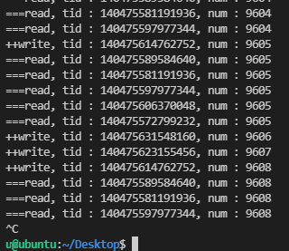

## 生产者和消费者

### 关系模型


### 存在问题

1. 当容器满时，无法继续生产
2. 当容器空时，无法继续消费
3. 多个生产者或消费者时，会出现线程同步问题

### 实例：简易版多生产者多消费者（互斥量，==存在未解决问题==）

- 说明

  - 当在删除节点时，加锁时机不同可能会导致段错误
  - 产生错误版在虚拟机下无法产生`core`文件，以下截图来自服务器，是否使用`-g`参数都能生成`core`文件，==可能是线程函数自带能够生成？==
  - 虚拟机版在**释放互斥锁前添加while死循环**即可正常生成`core`文件，所以不产生`core`文件的原因可能是==线程还在运行而互斥锁提前被释放了==

- 正常执行版

  ```c
  #include <stdio.h>
  #include <pthread.h>
  #include <stdlib.h>
  #include <unistd.h>
  
  // 链表作为容器
  struct Node{
      int val;
      struct Node* next;
  };
  
  // 头结点
  struct Node* head = NULL;
  
  // 互斥量
  pthread_mutex_t mutex;
  
  // 头插法增加元素
  void* producter(void* arg) {
      while (1) {
          pthread_mutex_lock(&mutex);
          struct Node* newNode = (struct Node*)malloc(sizeof(struct Node));
          newNode->val = rand() % 1000;
          newNode->next = head;
          head = newNode;
          printf("add node, num : %d, tid : %ld\n", newNode->val, pthread_self());
          pthread_mutex_unlock(&mutex);
          usleep(100);
      }
      return NULL;
  }
  
  // 头删法减少元素
  void* consumer(void* arg) {
      while (1) {
          pthread_mutex_lock(&mutex);
          struct Node* tmp = head;
          // 当链表不为空时，才能删除
          if (head != NULL) {
              head = head->next;
              printf("del node, num : %d, tid : %ld\n", tmp->val, pthread_self());
              free(tmp);
              pthread_mutex_unlock(&mutex);
              usleep(100);
          } else {
              pthread_mutex_unlock(&mutex);
          }
      }
      return NULL;
  }
  
  int main()
  {
      // 初始化互斥锁
      pthread_mutex_init(&mutex, NULL);
      // 创建5个生产者线程，和5个消费者线程
      pthread_t products[5], consumes[5];
      for (int i = 0; i < 5; i++) {
          pthread_create(&products[i], NULL, producter, NULL);
          pthread_create(&consumes[i], NULL, consumer, NULL);
      }
  
      // 分离，回收线程资源
      for (int i = 0; i < 5; i++) {
          pthread_detach(products[i]);
          pthread_detach(consumes[i]);
      }
  
      // 回收互斥锁
      pthread_mutex_destroy(&mutex);
      pthread_exit(NULL);     // 回收主线程
      return 0;
  }
  ```

  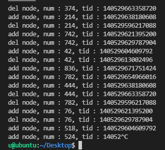

- 产生错误版（==原因还不清晰，后续再看==）

  ```c
  #include <stdio.h>
  #include <pthread.h>
  #include <stdlib.h>
  #include <unistd.h>
  
  // 链表作为容器
  struct Node{
      int val;
      struct Node* next;
  };
  
  // 头结点
  struct Node* head = NULL;
  
  // 互斥量
  pthread_mutex_t mutex;
  
  // 头插法增加元素
  void* producter(void* arg) {
      while (1) {
          pthread_mutex_lock(&mutex);
          struct Node* newNode = (struct Node*)malloc(sizeof(struct Node));
          newNode->val = rand() % 1000;
          newNode->next = head;
          head = newNode;
          printf("add node, num : %d, tid : %ld\n", newNode->val, pthread_self());
          pthread_mutex_unlock(&mutex);
          usleep(100);
      }
      return NULL;
  }
  
  // 头删法减少元素
  void* consumer(void* arg) {
      while (1) {
          // 如果只在头结点不为空的情况下使用互斥锁会产生段错误，暂未找到原因
          if (head != NULL) {
              pthread_mutex_lock(&mutex);
              struct Node* tmp = head;
              head = head->next;
              printf("del node, num : %d, tid : %ld\n", tmp->val, pthread_self());
              free(tmp);
              tmp = NULL;
              pthread_mutex_unlock(&mutex);
              usleep(100);
          }
      }
      return NULL;
  }
  
  int main()
  {
      // 初始化互斥锁
      pthread_mutex_init(&mutex, NULL);
      // 创建5个生产者线程，和5个消费者线程
      pthread_t products[5], consumes[5];
      for (int i = 0; i < 5; i++) {
          pthread_create(&products[i], NULL, producter, NULL);
          pthread_create(&consumes[i], NULL, consumer, NULL);
      }
  
      // 分离，回收线程资源
      for (int i = 0; i < 5; i++) {
          pthread_detach(products[i]);
          pthread_detach(consumes[i]);
      }
  	
      // 加while循环即可在虚拟机中生成core文件
      // while (1) {
      //     sleep(10);
      // }
      // 回收互斥锁
      pthread_mutex_destroy(&mutex);
      pthread_exit(NULL);     // 回收主线程
      return 0;
  }
  ```

  - 服务器

    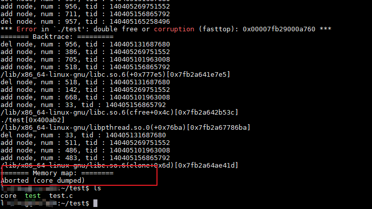

    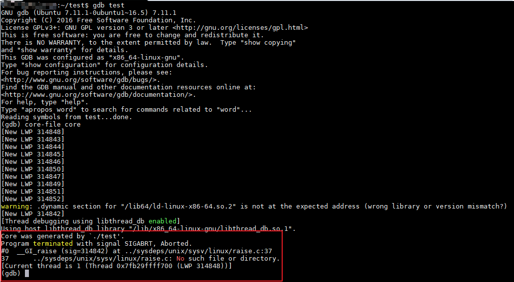

  - 虚拟机

    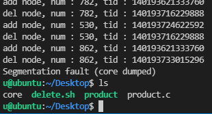

    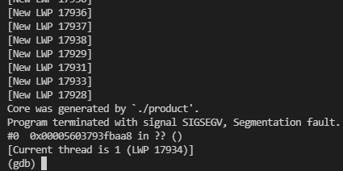

## 条件变量

### 条件变量相关操作函数

- 当满足条件时，才执行，不是锁，配合互斥量使用
- 条件变量的类型：`pthread_cond_t`
- 初始化：`int pthread_cond_init(pthread_cond_t *restrict cond, const pthread_condattr_t *restrict attr);`
- 回收：`int pthread_cond_destroy(pthread_cond_t *cond);`
- 等待，调用了该函数，线程会阻塞：`int pthread_cond_wait(pthread_cond_t *restrict cond, pthread_mutex_t *restrict mutex);`
- 等待多长时间，调用了这个函数，线程会阻塞，直到指定的时间结束：`int pthread_cond_timedwait(pthread_cond_t *restrict cond,  pthread_mutex_t *restrict mutex, const struct timespec *restrict abstime);`
- 唤醒一个或者多个等待的线程：`int pthread_cond_signal(pthread_cond_t *cond);`
- 唤醒所有的等待的线程：`int pthread_cond_broadcast(pthread_cond_t *cond);`

### 实例：条件变量下的多生产者多消费者

- 当有生产者生产时，通知消费者消费，否则等待

```c
#include <stdio.h>
#include <pthread.h>
#include <stdlib.h>
#include <unistd.h>

// 链表作为容器
struct Node{
    int val;
    struct Node* next;
};

// 头结点
struct Node* head = NULL;

// 互斥量
pthread_mutex_t mutex;
// 条件变量
pthread_cond_t cond;

// 头插法增加元素
void* producter(void* arg) {
    while (1) {
        pthread_mutex_lock(&mutex);
        struct Node* newNode = (struct Node*)malloc(sizeof(struct Node));
        newNode->val = rand() % 1000;
        newNode->next = head;
        head = newNode;
        printf("add node, num : %d, tid : %ld\n", newNode->val, pthread_self());
        
        // 只要生产了一个，就通知消费者消费
        pthread_cond_signal(&cond);

        pthread_mutex_unlock(&mutex);
        usleep(100);
    }
    return NULL;
}

// 头删法减少元素
void* consumer(void* arg) {
    while (1) {
        pthread_mutex_lock(&mutex);
        struct Node* tmp = head;
        // 当链表不为空时，才能删除
        if (head != NULL) {
            head = head->next;
            printf("del node, num : %d, tid : %ld\n", tmp->val, pthread_self());
            free(tmp);
            pthread_mutex_unlock(&mutex);
            usleep(100);
        } else {
            // 没有数据，需要等待
            // 当这个函数调用阻塞的时候，会对互斥锁进行解锁，当不阻塞的，继续向下执行，会重新加锁。
            pthread_cond_wait(&cond, &mutex);
            pthread_mutex_unlock(&mutex);
        }
    }
    return NULL;
}

int main()
{
    // 初始化互斥锁
    pthread_mutex_init(&mutex, NULL);
    // 初始化条件变量
    pthread_cond_init(&cond, NULL);
    // 创建5个生产者线程，和5个消费者线程
    pthread_t products[5], consumes[5];
    for (int i = 0; i < 5; i++) {
        pthread_create(&products[i], NULL, producter, NULL);
        pthread_create(&consumes[i], NULL, consumer, NULL);
    }

    // 分离，回收线程资源
    for (int i = 0; i < 5; i++) {
        pthread_detach(products[i]);
        pthread_detach(consumes[i]);
    }

    while (1) {
        sleep(10);
    }
    // 回收条件变量
    pthread_cond_destroy(&cond);
    // 回收互斥锁
    pthread_mutex_destroy(&mutex);
    pthread_exit(NULL);     // 回收主线程
    return 0;
}
```

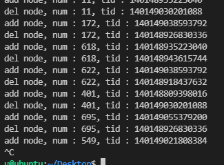

## 信号量

### 信号量相关操作函数

- 信号量的类型：`sem_t`
- `int sem_init(sem_t *sem, int pshared, unsigned int value);`
  - 功能：初始化信号量
  - 参数
    - `sem`：信号量变量的地址
    - `pshared`：0 用在线程间 ，非0 用在进程间
    - `value `：信号量中的值，代表容器大小
- `int sem_destroy(sem_t *sem);`
  - 功能：释放资源
- `int sem_wait(sem_t *sem);`
  - 功能：对信号量加锁，调用一次对信号量的值-1，如果值为0，就阻塞
- `int sem_trywait(sem_t *sem);`
- `int sem_timedwait(sem_t *sem, const struct timespec *abs_timeout);`
- `int sem_post(sem_t *sem);`
  - 功能：对信号量解锁，调用一次对信号量的值+1
- `int sem_getvalue(sem_t *sem, int *sval);`

### 实例：信号量下的多生产者多消费者

- 不需要单独判断`容器`为空的情况

```c
#include <stdio.h>
#include <pthread.h>
#include <stdlib.h>
#include <unistd.h>
#include <semaphore.h>

// 链表作为容器
struct Node{
    int val;
    struct Node* next;
};

// 头结点
struct Node* head = NULL;

// 互斥量
pthread_mutex_t mutex;
// 信号量
sem_t psem;
sem_t csem;

// 头插法增加元素
void* producter(void* arg) {
    while (1) {
        sem_wait(&psem);
        pthread_mutex_lock(&mutex);
        struct Node* newNode = (struct Node*)malloc(sizeof(struct Node));
        newNode->val = rand() % 1000;
        newNode->next = head;
        head = newNode;
        printf("add node, num : %d, tid : %ld\n", newNode->val, pthread_self());
        pthread_mutex_unlock(&mutex);
        sem_post(&csem);
    }
    return NULL;
}

// 头删法减少元素
void* consumer(void* arg) {
    while (1) {
        sem_wait(&csem);
        pthread_mutex_lock(&mutex);
        struct Node* tmp = head;
        // 当链表不为空时，才能删除
        if (head != NULL) {
            head = head->next;
            printf("del node, num : %d, tid : %ld\n", tmp->val, pthread_self());
            free(tmp);
            pthread_mutex_unlock(&mutex);
            sem_post(&psem);
        }
    }
    return NULL;
}

int main()
{
    // 初始化互斥锁
    pthread_mutex_init(&mutex, NULL);
    // 初始化信号量
    // 最多生产8个
    sem_init(&psem, 0, 8);
    // 初始没有东西可以消费
    sem_init(&csem, 0, 0);

    // 创建5个生产者线程，和5个消费者线程
    pthread_t products[5], consumes[5];
    for (int i = 0; i < 5; i++) {
        pthread_create(&products[i], NULL, producter, NULL);
        pthread_create(&consumes[i], NULL, consumer, NULL);
    }

    // 分离，回收线程资源
    for (int i = 0; i < 5; i++) {
        pthread_detach(products[i]);
        pthread_detach(consumes[i]);
    }

    while (1) {
        sleep(10);
    }
    // 回收信号量
    sem_destroy(&csem);
    sem_destroy(&psem);
    // 回收互斥锁
    pthread_mutex_destroy(&mutex);
    pthread_exit(NULL);     // 回收主线程
    return 0;
}
```

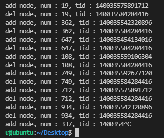
